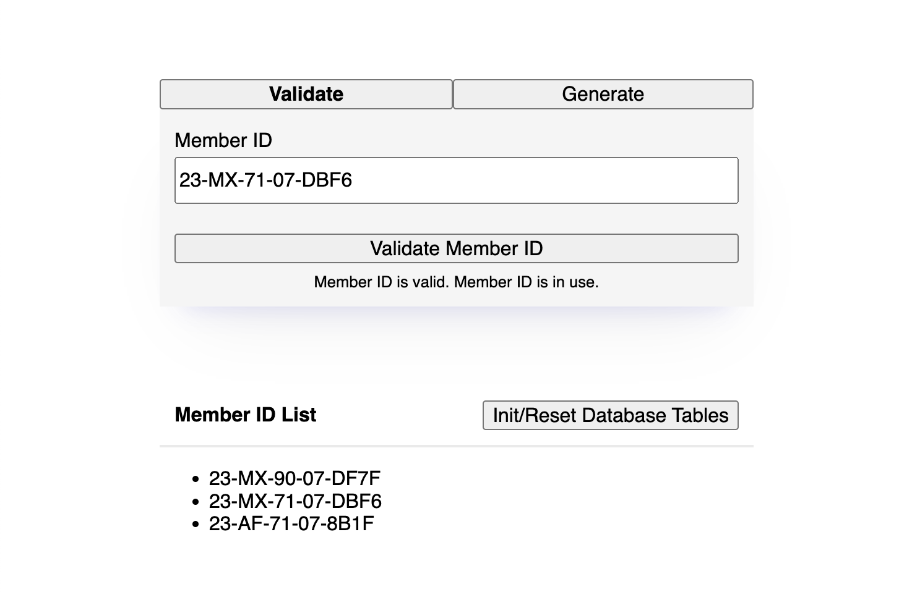

# Member ID Demo

### About

Separately dockerized frontend, api, and cache to demonstrate generating and validating membership ids. Tasked with making this in 24-48 hours, having a local dev setup, and running in prod.

Frontend (directory: www) is a Vite typescript bundled single page application, with a simple widget using React + Styled Components. Gives feedback on generation/validation submissions.

Backend (directory: api) is an API using async Python with the Sanic framework. Instead of tracking member ids in a list/set, I setup a Postgres SQL database wit hthe cluster (at first, I used SQLite in-memory but didn't want it to clear in production). In the docker-compose/cluster config, you'll also find a redis instance which is being used by an endpoint caching decorator on various routes.

### Setup

This cluster setup utilizes the AWS Secrets Manager for pulling configs/vars that coordintaes services. For this demo, the basic credentials will placed in a `.env` file in the root of this directory. Ask Mark for this file.

Once you have your credentials, startup is easy! Just 1) `docker-compose up` and then 2) when in the interface, hit the "Init/Reset Database Tables" button to create the `member_id` and `user` tables in the SQL database. MemberIDs have a foreign key that relates back to users. Users hold all PII if ops needed to check credentials.

### Tests

There are two types of tests on this, frontend E2E with pupeteer and backend unit tests with pytest. For both, you will want the cluster running via `docker-compose up`.

For backend tests, you first need to bash into the container so relative paths work and dependencies are present.

1. `docker exec -it asaphw-api-1 bash` (no need to change directory once bashed in)
2. `pytest src/member_id/__tests__/member_id_utils.py`

For frontend tests, we'll be utilizing chromium browser from outside our container.

1. Navigate to the `www` directory and `yarn install`.
2. With our dependencies installed (most importantly jest/puppeteer), run `yarn test`

---

